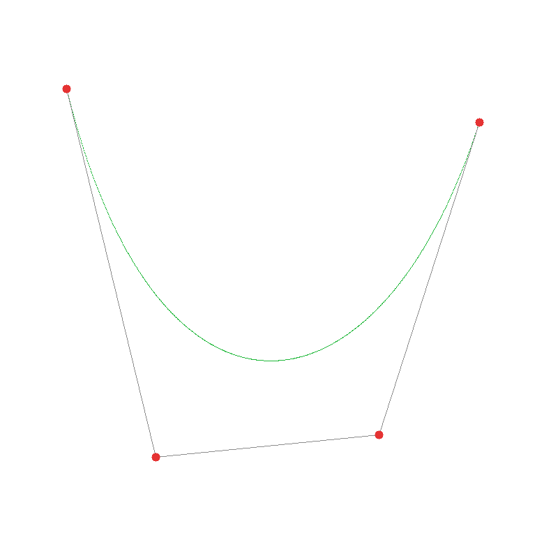

# 实验三：Bézier 曲线与 De Casteljau 算法

这个实验我用 `Python + Taichi` 做了一个交互式 Bézier 曲线绘制程序，完成了题目要求里的基础部分：

- 使用 `De Casteljau` 算法计算 Bézier 曲线点
- 在像素缓冲区中直接光栅化曲线
- 使用鼠标左键添加控制点
- 使用 `C` 键清空画布
- 实时显示控制点与控制多边形

## 运行效果



程序运行时：

- 鼠标左键点击画布：添加控制点
- 实时显示：红色控制点、灰色控制多边形、绿色 Bézier 曲线
- 按 `C` 键：清空控制点和曲线
- 按 `Esc`：退出程序

## 环境

- Python 3.13+
- `taichi`
- `numpy`

## 运行方式

```bash
python3 main.py
```

如果想重新生成 README 里的静态演示图：

```bash
python3 main.py --save-preview preview.png
```

## 实现说明

### 1. De Casteljau 算法

对于一组控制点 `P0, P1, ..., Pn-1` 和参数 `t ∈ [0, 1]`：

- 对每对相邻控制点做一次线性插值
- 得到更短的一组新点
- 重复上述过程
- 最终剩下的唯一一点就是曲线在 `t` 处的位置

程序里这部分是用纯 Python 写的 `de_casteljau(points, t)` 来完成的。

### 2. CPU 采样 + GPU 绘制

如果在 Python 里每算出一个点就直接去改 GPU 里的像素，速度会比较慢，所以这里用了“先批量算，再一次性传”的方式：

- CPU 端先将整条曲线采样为 `1001` 个点
- 使用 `curve_points_field.from_numpy(...)` 一次性传给 GPU
- 再由 `draw_curve_kernel()` 在 GPU 中并行完成像素点亮

### 3. 交互显示

- 鼠标点击时，记录归一化坐标 `[x, y]`
- 当控制点数不少于 2 个时，自动重新采样并重绘曲线
- `gui_points` 仍然使用固定容量对象池，未使用的位置半径设为 0，这样 `canvas.circles()` 可以稳定接收定长 Field

主程序里比较核心的几个函数有：

- `de_casteljau(points, t)`
- `sample_bezier(points, num_segments)`
- `clear_pixels_kernel()`
- `draw_curve_kernel(n)`
- `build_gui_points_array(control_points, max_points)`

## 结果说明

- 当只有 2 个控制点时，曲线退化为一条线段
- 曲线起点经过第一个控制点，终点经过最后一个控制点
- 连续添加控制点时，曲线形状会实时变化
- 按 `C` 键后所有控制点与曲线都会被清空

## 可扩展内容

这次我先只完成了必做部分，后面还可以继续加：

- 反走样 Bézier 曲线
- 均匀三次 B 样条曲线
- Bézier / B 样条模式切换
